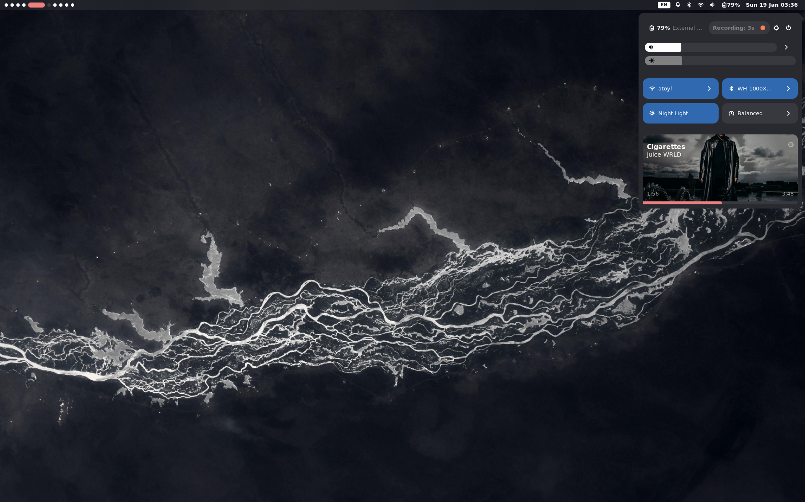

# LucioBar

https://github.com/user-attachments/assets/d142e57d-a25d-4ddb-ab46-311417458211

Bar and widgets made with ags by me.

Heavily inspired by gnome/macos/tesla type design.

## Requirements

Below is a list of requirements for the specific widgets/functions to work as intended

* Wifi: `networkmanager`
* Workspaces: `hyprland`
* Keymap: `jq`, `hyprland`
* Notifications: No other notification daemon running
* Bluetooth: `bluez`
* Sound: `playerctl`, `pulseaudio`/`pipewire-pulse`
* Powerprofiles: `power-profiles-daemon`
* Recorder: `wf-recorder`

## The widgets

You will find the widgets under `./modules`.

I have two types of powermenu, `powermenu` and `powermenuRight`. On my setup i use both. One on the right for activation from the control center, and one centered which i activate with a keybind: `$mainMod, ESCAPE, exec, ags -r "togglePopup('powermenu')"'`
